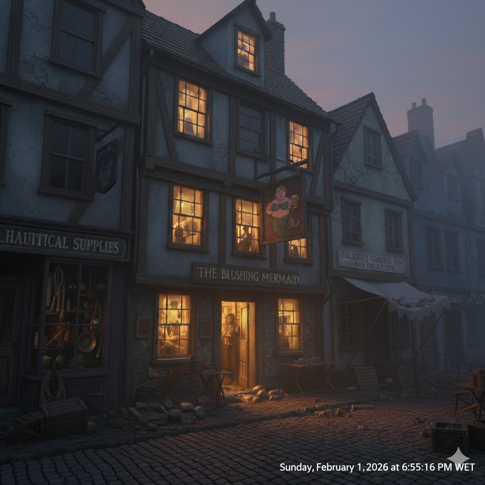
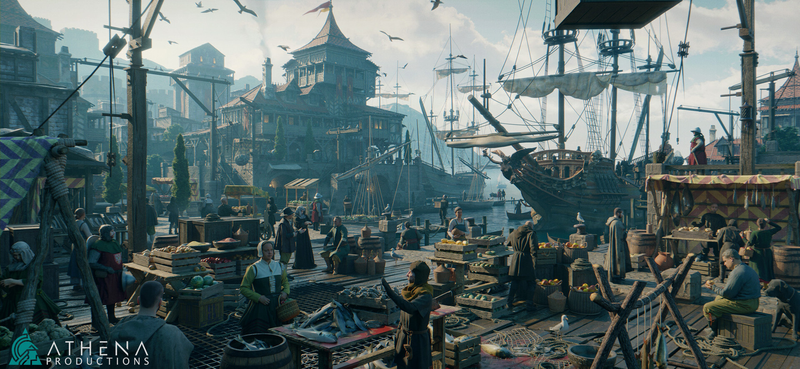

<figure></img></figure>
<h1 style='border: none; text-align: center'>The lost archipelago</h1>
<h3 style='border: none; text-align: center'>A Shadowdark Adventure</h3>

# The Lost Archipelago
## Session 1 - The Pale Maiden
### Introduction

In session 1 the players will receive the quest from Gwen
to search for her grandmother and retreive **The tears of the forgotten**.

The harbourmaster reveals the only man mad enough to travel there is **Capt. John Flint.**

Cap. John Flint and the pirate crew may be convinced, for a price, to sail the adventurers
there, but unbenknownst to the players John Flint and his crew are pirates and are also looking
for the same artifact.

Most of the session happens in the high seas where the players deal with the crew and the dangers of sailing.

### The Blushing Mermaid
> A nossa aventura começa em Baldur's Gate, a maior cidade da Sword Coast. 
> A cidade é um **labirinto de ruas e construções de madeira, onde mercadores e mercenários 
> convivem com nobres e ladrões. Oportunidade e perigo caminham lado a lado por estas ruas**.
>
> Esta noite, no distrito das docas, onde armazéns e tavernas se alinham à beira-mar. 
> Marinheiros de folga cambaleiam entre estabelecimentos, 
> e trabalhadores do porto seguem para casa após longos turnos.
>
> À vossa frente está **The Blushing Mermaid** - uma taverna de três andares entre uma loja de velas náuticas 
> e uma pensão barata. Uma placa de madeira gasta range ao vento, mostrando 
> uma sereia mal pintada com bochechas rosadas. 
> Luz quente escapa pelas janelas manchadas de sal, e vocês podem ouvir música e risadas vindas de dentro.

> Vocês empurram a porta e entram.
>
> O salão principal está cheio de marinheiros e trabalhadores do porto, as suas vozes altas com bebida e gargalhadas. 
> O teto baixo aprisiona o fumo de cachimbos e o cheiro a peixe frito. 
> **Atrás do balcão, uma mulher na casa dos trinta anos** com cabelos escuros e um avental manchado de trabalho 
> chama logo à vossa atenção.
> Ela está a servir um cliente, mas olha para vocês, e vocês veem reconhecimento 
> e alívio passar rapidamente pelo seu rosto.

#### Gwen Ashford - The Bartender

- Early 30s; Tired eyes, but kind smile
- Hardworker; **desperate but trying to hide it**
- Wipes the bar while talking (nervous habit)
- Touches a silver locket she wears (contains a picture of young Miriam)
- Calls people "love" or "dear" habitually

> Ela acaba de servir o cliente e chama-vos com um gesto
>
> "Graças a deus que vieram... Venham, vamos conversar num sítio mais silencioso"
>
> Ela guia-vos para uma porta atrás do balcão que leva a um pequeno espaço de armazenamento 
> convertido em escritórios.
>
> Sentem-se, sentem-se, ponham-se à vontade - diz ela enquanto puxa umas caixas para que se possam sentar.
> Ela fecha a porta, abafando o barulho da taverna e vira-se para vocês
>
> "Eu preciso da vossa ajuda."

Once everyone is settled, Gwen takes a breath. She's clearly been holding this in.

> "Eu preciso da vossa ajuda. A minha avó - Miriam Ashford - está desaparecida. 
> Ela desapareceu há 6 meses, e eu consigo sentir que ela ainda está viva, mas está em perigo. 
> Preciso que alguém a traga para casa.
>
> She pauses, gauging their reactions.
>
> Eu posso pagar! Não uma fortuna mas... 50 peças de ouro assim que aceitarem o contrato.
> Quando a trouxerem viva podem ficar com aquilo que ela foi procurar... Vale muito, mais riqueza do que possam
> imaginar...

**The Full Explanation:**

- A Avó criou a Gwen desde que os seus pais morreram
- Ela é uma investigadora na universidade de neverwinter, brilhante, teimosa
   obsecada por mitos e lendas.
- Há seis meses convenceu-se que um antigo mito era real. "As Lágrimas dos anciães"
- Este diário é dela, o corvo dela entregou-mo. A última entrada foi o mês passado,
   ela chegou à ilha, encontrou o que procurava mas nunca regressou... Leiam quando tiverem tempo, pode vos ajudar.
- **As lágrimas dos anciães** estes cristais que ela encontrou... supostamente valem uma fortuna.
   O suficiente para uma vida. Se a trouxerem viva, podem ficar com eles.

#### O que a Gwen Sabe

- Miriam acredita que **As lágrimas dos anciães** estão no Lost Hope Archipelago.
- contratou o capitão **Threon Vey** para a levar, o capitão nunca regressou
- passado uns meses o corvo da avó trouxe a miriam o seu diário
- A avó encontrou o artefacto - leiam o diário quando tiverem tempo
- **Lost Hope Archipelago** e a ilha principal **The Gloaming** têm má reputação
a avó contou que a ilha pertencia a uma antiga civilização que desapareceu.
- Poucas pessoas chegaram lá vivas e ainda menos regressaram
- A melhor hipótese para chegar lá é contratar nas docas alguém para vos levar, mas não será fácil.

> "And... be careful. If the stories are true, that place is cursed. Come back alive. All of you."
> - She escorts them back through the tavern to the door. Before they leave: -
> "Thank you. I'll light a candle for you at the temple. Gods know you'll need it."

Test

### The Docks

As docas são um lugar caótico, por todo o lado há movimento.
Pescadores a amanhar redes, marinheiros a carregar provisões.
Gaivotas voam em circulos à espera de algum vendedor distraído a que 
possam roubar um almoço.

Este é o verdadeiro coração de baldur's gate.

